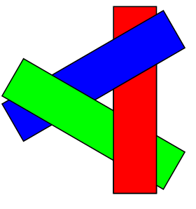

## Descripcion

El nombre "algoritmo del pintor" se refiere a la técnica empleada por muchos pintores donde comienzan pintando partes distantes de una escena antes que partes más cercanas, cubriendo así algunas áreas de partes distantes. De manera similar, el algoritmo del pintor ordena todos los polígonos en una escena por su profundidad y luego los pinta en este orden, del más lejano al más cercano. Pintará sobre las partes que normalmente no son visibles, resolviendo así el problema de visibilidad, a costa de haber pintado áreas invisibles de objetos distantes. _[**Algoritmo del pintor**](https://en.wikipedia.org/wiki/Painter%27s_algorithm)_

En esta imagen de ejemplo se pintan primero las montañas lejanas, seguidas por el prado; finalmente se dibujan los objetos más cercanos, los árboles.

## Algoritmo

Conceptualmente, el algoritmo de Painter funciona de la siguiente manera:

  1. Ordenar cada polígono por profundidad
  2. Coloque cada polígono desde el polígono más lejano al polígono más cercano



## Ventajas
  * El algoritmo del pintor no es tan complejo en estructura como sus otras contrapartes del algoritmo de clasificación en profundidad.
  * Esta simplicidad lo hace útil en escenarios de salida de gráficos de computadora básicos donde un renderizado no sofisticado deberá realizarse con poca dificultad.
  * El algoritmo del pintor prioriza el uso eficiente de la memoria, pero a expensas de una mayor potencia de procesamiento, ya que se deben renderizar todas las partes de todas las imágenes.

## Limitaciones

  * En el caso de superposición cíclica, como se muestra en la siguiente figura, los polígonos A, B y C se superponen entre sí de tal manera que es imposible determinar qué polígono está por encima de los demás.

  

  * El caso de perforar polígonos surge cuando un polígono se cruza con otro. De manera similar a la superposición cíclica, este problema se puede resolver cortando los polígonos ofensivos.

  * En implementaciones básicas, el algoritmo del pintor puede ser ineficaz. Obliga al sistema a representar cada punto en cada polígono del conjunto visible, incluso si ese polígono está ocluido en la escena final. Esto significa que, para escenas detalladas, el algoritmo del pintor puede sobrecargar el hardware de la computadora.