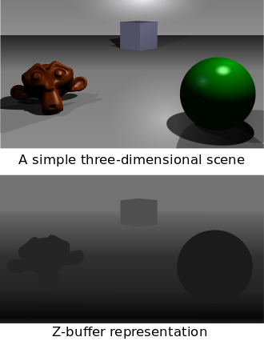
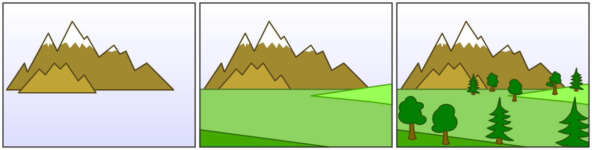

## Descripcion

Descrita por Wolfgang Straßer en su tesis doctoral sobre algoritmos rápidos para el renderizado de objetos ocluidos. El algoritmo funciona, cuando en un pipeline de renderizado 3d, cuando se proyecta un objeto en la pantalla, la profundidad (valor z) de un fragmento generado en la imagen de la pantalla proyectada se compara con el valor ya almacenado en el buffer (test de profundidad), y lo sustituye si el nuevo valor es más cercano. Funciona en tándem con el rasterizador, que calcula los valores de color. El fragmento emitido por el rasterizador se guarda si no se solapa con otro fragmento. _[**Z-buffering**](https://en.wikipedia.org/wiki/Z-buffering)_

## Usabilidad

 En la actualidad, su uso principal es el de los videojuegos, que requieren un procesamiento rápido y preciso de las escenas en 3D. Además, los datos del buffer Z obtenidos al renderizar una superficie desde el punto de vista de la luz permiten la creación de sombras mediante la técnica de mapeo de sombras.



## Z-buffer vs el Algoritmo del pintor

Si se estuviera dibujando una escena en un lienzo 2D, se gestionarí la profundidad dibujando primero los objetos más lejanos. De esta manera, los objetos más cercanos tienen la posibilidad de dibujarse encima de los objetos más lejanos dibujados previamente. Esto se llama el algoritmo del pintor.

Sin embargo, con Z-buffer, se pude dibujar cosas en cualquier orden y se seguirá mostrando los objetos más cercanos delante (a menos que se diga lo contrario expliciamente). Lo hace registrando la profundidad de cada píxel en un buffer de profundidad, que es como una imagen monocromática del mismo tamaño que el lienzo principal. En lugar de interpretar los valores de los píxeles en el buffer de profundidad como colores, los lee como profundidad.



## Ventajas y desventajas

### Ventajas:
- Fácil de usar.
- Puede implementarse fácilmente en sapce de objetos o imágenes.
- Se puede ejecutar rápidamente, incluso con muchos polígonos.
### Desventajas:
- Ocupa mucha memoria.
- No puede hacer superficies transparentes sin código adicional.

## El algoritmo de desenfoque

El algoritmo consiste en mirar todos los píxeles cercanos que se pueda, y detectar si se esta lo suficientemente cerca como para que su desenfoque toque el píxel actual, y si ese desenfoque iría por delante o por detrás del píxel actual. _[**Desenfoque p5.js**](https://editor.p5js.org/davepagurek/sketches/cmcqbj1II)_




```js
// First of all, initialize the depth of each pixel.
d(i, j) = infinite // Max length

// Initialize the color value for each pixel to the background color
c(i, j) = background color

// For each polygon, do the following steps :
for (each pixel in polygons projection)
{
    // Find depth i.e, z of polygon
    //   at (x, y) corresponding to pixel (i, j)   
    if (z < d(i, j))
    {
        d(i, j) = z;
        c(i, j) = color;
    }
}

```


## Referencias
- https://www.davepagurek.com/blog/depth-of-field/
- https://www.davrous.com/2013/06/21/tutorial-part-4-learning-how-to-write-a-3d-software-engine-in-c-ts-or-js-rasterization-z-buffering/#code4js
- https://www.cs.helsinki.fi/group/goa/render/piilopinnat/z_buffer.html